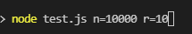
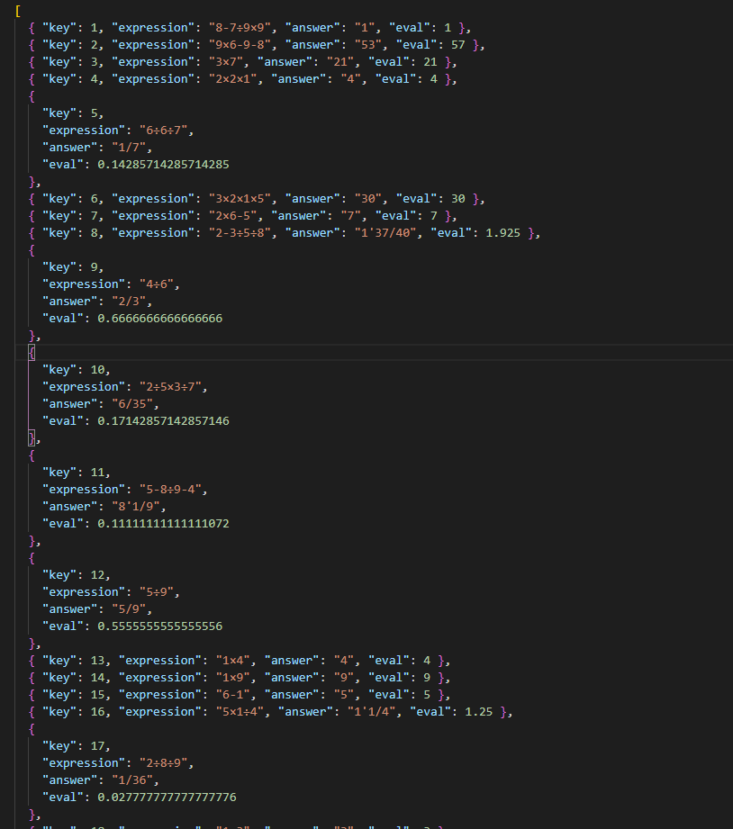

[TOC]

| 这个作业属于哪个课程 | [班级链接](https://edu.cnblogs.com/campus/gdgy/InformationSecurity1912-Softwareengineering) |
| :------------------: | :----------------------------------------------------------: |
|  这个作业要求在哪里  | [作业链接](https://edu.cnblogs.com/campus/gdgy/InformationSecurity1912-Softwareengineering/homework/12147) |
|    这个作业的目标    |               四则运算生成器+生成应用程序+结对               |
|      项目成员1       |                       3119005476温桂豪                       |
|      项目成员2       |                       3119005470罗行健                       |

## 代码连接

[GitHub链接](https://github.com/HHchhhhh/RuanGong)

## 实现

### 其他方法的实现

#### 获取命令行参数列表

1. 获取命令行参数的数组
2. 对`=`进行分割，拿到生成题目的数量和单个数值的范围
3. 返回到对应的位置

```js
/**
 * 获取参数列表
 * @param {Array} arr 
 * @param {String} parmName 
 * @returns 
 */
function getParams(arr, parmName) {
  for (let i = 2; i < arr.length; i++) {
    let expression = arr[i];
    let expArr = expression.split('='); //分割等式左右的值
    if (expArr[0] === parmName) return expArr[1];
  }
}

module.exports = getParams;
```

#### 获取随机数

1. 根据传入的参数确定随机数的范围
2. 生成随机数
3. 如果是零则重新生成，因为没有意义

```js
/**
 * 获取随机数
 * @param {Number} number 
 * @returns 
 */
function getRandom(number) {
  let num = Math.floor(Math.random() * number);
  while(num === 0) {
    num = Math.floor(Math.random() * number);
  }
  return num
}
module.exports = getRandom;
```

#### 定义操作符

```js
// 定义操作符
module.exports.operators = ['+', '-', '÷', '×'];
```

## 主函数实现

### 入口函数

1. 生成表达式并判断是否符合要求
2. 将生成的表达式放入计算函数进行计算
3. 调用eval生成小数结果
4. 将生成的表达式、计算结果和小数结果写入json文件中

```js
/**
 * 生成等式并写入json文件
 * @param {Number} n 生成题目的条数
 * @param {Number} r 每个数值的范围
 * @returns {null}
 */
function generate(n, r) {
  let exercises = []; // 作为参数到计算结果的练习题
  let answers = [];
  let data = []
  for (let i = 0; i < n; i++) {
    let expression = ifLogical(r, exercises); // 判断表达式是否符合逻辑 如果符合逻辑，就返回一个表达式
    let answer = calculate(expression);
    let ex = ''
    for(let j = 0; j < expression.length; j++) {
      if(expression[j] === '×') {
        ex += '*'
        continue
      }
      if(expression[j] === '÷') {
        ex += '/'
        continue
      }
      ex += expression[j]
    }
    let e = eval(ex)
    data.push({
      key: i + 1,
      expression,
      answer,
      eval: e,
    })
  }
  fs.writeFileSync('exercises.json', JSON.stringify(data));
}
```

### 生成和判断函数

1. 调用随机数函数生成这个表达式中运算符的个数
2. 调用生成运算符函数，生成运算符数组
3.  调用生成表达式函数，生成表达式
4. 判断表达式是否合法

```js
function ifLogical(r, exercises) {
  // 获取运算符个数
  let operatorNum = getRandom(4); 
  // 如果运算符个数为0 不符合条件 继续获取 operatorNum
  while (operatorNum === 0) {
    operatorNum = getRandom(4);
  }
  // 得到运算符数组
  let opArr = getOperators(operatorNum);
  // 生成运算表达式 
  let expression = generateEq(r, opArr);
  let flag = true;
  while (flag) {
    let newExp = expression.replace(/\÷/g, '/').replace(/\×/g, '*');
    let answer = eval(newExp);
    if (answer < 0 || isCommon(exercises, expression)) {
      // if (answer < 0) {
      let operatorNum = getRandom(4);
      opArr = getOperators(operatorNum);
      expression = generateEq(r, opArr);
    } else {
      flag = false;
    }
  }
  return expression;
}
```

### 生成运算符函数

1. 循环生成随机数，根据生成的随机数来选择运算符
2. 将生成的运算符放入数组中，并返回

```js
/**
 * 生成运算符数组：根据生成的随机数来随机选取其中一个操作符
 * @param {Number} n 需要生成的运算符个数
 * @returns {Array} 返回一个包含运算符的数组
 */
function getOperators(n) {
  let arr = [];
  for (let i = 0; i < n; i++) {
    let random = getRandom(4);
    arr.push(operators[random]);
  }
  return arr;
}
```

### 生成表达式函数

1. 生成随机数
2. 根据运算符判断生成的随机数是否合法，如果随机数不合法则重新生成（如除号后面不能为1，乘号两侧不能为1）
3. 返回生成表达式

```js
/**
 * 根据传入的运算符数组 生成一条表达式
 * @param {Number} r 每个数值的范围 
 * @param {Array} opArr 运算符数组
 * @returns {String} 一个表达式字符串
 */
function generateEq(r, opArr) {
  // 等式
  let eq = ''; 
  let eqArr = [];
  // 生成随机数作为表达式中的数值
  let orginNum = getRandom(r);

  if (opArr.length === 0) {
    return;
  } else {
    eqArr.push(orginNum);
    for (let i = 0; i < opArr.length; i++) {
      eqArr.push(opArr[i]);
      if (opArr[i] === '÷') {
        while (eqArr[2 * i] === r - 1) {
          eqArr[2 * i] = getRandom(r);
        }
        let rightNum = ifDevision(eqArr, i, r);
        eqArr.push(rightNum);
      }
      else if(opArr[i] === '*') {
        while (eqArr[2 * i] === 1) {
          eqArr[2 * i] = getRandom(r);
        }
        let rightNum = getRandom(r)
        while(rightNum === 1) {
          rightNum = getRandom(r)
        }
        eqArr.push(rightNum)
      }
      else {
        let rightNum = getRandom(r);
        eqArr.push(rightNum);
      }
    }
  }
  return eqArr.join('');
}
```

### 计算函数

1. 将传入的表达式按照数字和运算符分割，生成表达式数组
2. 将数字转换成分数（即数字/1）
3. 遍历数组计算乘除法，如果不是乘除法则放入栈中
4. 弹出栈中的运算符，计算加减法
5. 进行约分

```js
function calculate(ex) {
    let arr = []
    arr[0] = ''
    let j = 0
    for(let i = 0; i < ex.length; i++) {
        if(ex[i] === '×' || ex[i] === '÷' || ex[i] === '+' || ex[i] === '-') {
            j++
            arr[j] = ex[i]
            j++
            arr[j] = ''
        }else{
            arr[j] += ex[i]
        }
    }
    for(let i = 0; i < arr.length; i += 2) {
        arr[i] = [Number(arr[i]), 1]
    }
    let numStk = []
    let fStk = []
    for(let i = 0; i < arr.length; i++) {
        // console.log(arr[i])
        if(i % 2) {
            if(arr[i] === '×') {
                let pre = numStk.pop()
                let next = arr[i + 1]
                numStk.push([pre[0] * next[0], pre[1] * next[1]])
                i++
            }
            if(arr[i] === '÷') {
                let pre = numStk.pop()
                let next = arr[i + 1]
                numStk.push([pre[0] * next[1], pre[1] * next[0]])
                i++
            }
            if(arr[i] === '+' || arr[i] === '-') {
                fStk.push(arr[i])
            }
        }else{
            numStk.push(arr[i])
        }
    }
    while(fStk.length) {
        let f = fStk.pop()
        let next = numStk.pop()
        let pre = numStk.pop()
        if(f === '+') {
            numStk.push([
                pre[0] * next[1] + next[0] * pre[1], 
                pre[1] * next[1]
            ])
        }else{
            numStk.push([
                pre[0] * next[1] - next[0] * pre[1], 
                pre[1] * next[1]
            ])
        }
    }
    let res = numStk.pop()
    return yuefen(res[0], res[1])
}
```

#### 约分函数

1. 判断是否是整数，如果是则返回
2. 判断是否是带分数，如果是则先转换整数部分再约分
3. 调用函数生成两个数的最大公约数
4. 两个数同时除以最大公约数
5. 拼接字符串

```js
/**
 * 将假分数化成真分数并进行约分
 * @param {Number} top 
 * @param {Number} bot 
 * @returns 
 */
function yuefen(top, bot) {
    if(top / bot === Math.floor(top / bot)) {
        return '' + (top / bot) + ''
    }
    let s = ''
    if(top > bot) {
        s += Math.floor(top / bot)
        s += "'"
        top = top % bot
    }
    let divisor = countDivior(top, bot)
    s += (top / divisor) + '/' + (bot / divisor)
    return s
}
```

#### 生成最大公约数函数

```js
/**
 * 求最大公约数
 * @param  {...any} arr 
 * @returns 
 */
function countDivior(...arr) {
    let data = [].concat(...arr);
    const helperGcd = (x, y) => (!y ? x : countDivior(y, x % y));
    return data.reduce((a, b) => helperGcd(a, b));
  };
```

## 性能分析


- 对性能比较满意

## 测试结果

- 命令行输入方式：`node test.js n=需要生成题目的数量 r=单个数值的范围`

在命令行输入：



生成10000道10以内的四则运算题，将js对象转换为JSON对象存入exercises.json中，在exercises.json可以查看到生成的结果



（由于数据太多，这里只放出一部分的数据）

## PSP表格

| PSP2.1                                  | Personal Software Process Stages        | 预估耗时 | 实际耗时（分钟） |
| --------------------------------------- | --------------------------------------- | -------- | ---------------- |
| ·Planning                               | · 计划                                  | 30       | 40               |
| · Estimate                              | · 估计这个任务需要多少时间              | 30       | 45               |
| ·Development                            | 开发                                    | 200      | 400              |
| · Analysis                              | · 需求分析 (包括学习新技术)             | 35       | 60               |
| · Design Spec                           | · 生成设计文档                          | 35       | 55               |
| · Design Review                         | · 设计复审                              | 50       | 160              |
| · Coding Standard                       | · 代码规范 (为目前的开发制定合适的规范) | 20       | 25               |
| · Design                                | · 具体设计                              | 40       | 45               |
| · Coding                                | · 具体编码                              | 100      | 200              |
| · Code Review                           | · 代码复审                              | 30       | 35               |
| · Test                                  | · 测试（自我测试，修改代码，提交修改）  | 30       | 125              |
| · Reporting                             | · 报告                                  | 60       | 80               |
| · Test Repor                            | · 测试报告                              | 25       | 20               |
| · Size Measurement                      | · 计算工作量                            | 20       | 15               |
| · Postmortem & Process Improvement Plan | · 事后总结, 并提出过程改进计划          | 40       | 50               |
|                                         | · 合计                                  | 745      | 1355             |

## 项目小结

该项目使用JavaScript完成，因为JavaScript是一种前端语言，所以这次项目实际写起来会遇到一些阻碍，特别是对数据处理方面，以及代码的复查，这次项目在这几个方面花费的时间是最多的。由于语言的不同和技术的差距，这次项目的编程是由精通前端的组员罗行健完成的，组员温桂豪负责的是算法思路的设计和报告的编写，在报告中，因为JavaScript的局限性，在性能分析上手段不多，且没有其他语言完善，希望老师能够谅解。

成员1：罗行健

在刚看到项目要求的时候，并没有想用JavaScript去写，在项目前期查找资料和借鉴前几届师兄师姐项目的过程中，发现大部分都是使用Java和python来实现，没有人用JavaScript，刚好自己精通JavaScript，于是便想着挑战一下自己，虽然过程有些艰辛，但最后项目完成也是对自己的一种突破。

成员2：温桂豪

在本次项目中我负责较为简单的部分，提供四则运算算法编写的思路，同时我也在学习JavaScript语言，边写边用，进行报告的撰写，最后在罗行健同学的协助下完成了报告的编写，在这次项目中让我感受最深的是多人合作编程的优点，每个人可以专注自己的部分，可以花更多的时间去打磨自己的任务，提升了项目的整体水平。
